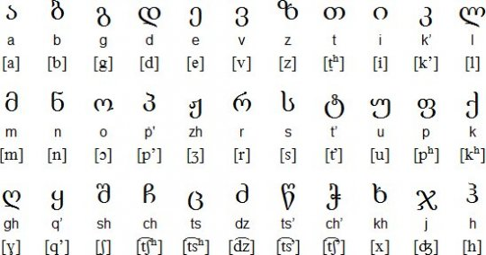

# English to Georgian and Vice Versa

## Georgian alphabet



| In Georgian | In English | Pronunciation                                                                                             |
| ----------- | ---------- | --------------------------------------------------------------------------------------------------------- |
| ა           | a          | <video src="https://github.com/user-attachments/assets/b9f58015-9338-4250-94e9-5b3074e511a2.mov"></video> |
| ბ           | b          | <video src="https://github.com/user-attachments/assets/753fc08f-8c37-409d-a485-9eff13df9545.mov"></video> |
| გ           | g          | <video src="https://github.com/user-attachments/assets/5d361dc9-c4f5-4058-ba11-f98b53d69bac.mov"></video> |
| დ           | d          | <video src="https://github.com/user-attachments/assets/4bceceee-61d6-4e74-9586-f106db7e25fa.mov"></video> |
| ე           | e          | <video src="https://github.com/user-attachments/assets/7d8f4dd1-0eca-45e6-8e37-dfed1331313a.mov"></video> |
| ვ           | v          | <video src="https://github.com/user-attachments/assets/56914c01-42cc-4096-a735-657155179f9a.mov"></video> |
| ზ           | z          | <video src="https://github.com/user-attachments/assets/2b6dc021-b593-4c1f-b2a1-e8729d22f203.mov"></video> |
| თ           | th         | <video src="https://github.com/user-attachments/assets/576d805f-9783-4823-8d60-e962ba9a3c92.mov"></video> |
| ი           | i          | <video src="https://github.com/user-attachments/assets/eecfc329-caa2-4077-babf-93c3c3588bb1.mov"></video> |
| კ           | k'         | <video src="https://github.com/user-attachments/assets/3441eb97-2a4e-4e9a-b8ee-cd6daf0901cc.mov"></video> |
| ლ           | l          | <video src="https://github.com/user-attachments/assets/d4714a2f-31f1-49de-b7f3-48720c713c2d.mov"></video> |
| მ           | m          | <video src="https://github.com/user-attachments/assets/c9192c7a-33af-4ea2-98d7-2e3ec61a83a1.mov"></video> |
| ნ           | n          | <video src="https://github.com/user-attachments/assets/211363a2-e50e-44eb-8804-49042ecf58fc.mov"></video> |
| ო           | o          | <video src="https://github.com/user-attachments/assets/1b5f1ced-018f-47d9-a208-58fb7b3f8ab9.mov"></video> |
| პ           | p'         | <video src="https://github.com/user-attachments/assets/3b9e7f1c-b990-4b62-8063-fb4abb0ae2d3.mov"></video> |
| ჟ           | zh         | <video src="https://github.com/user-attachments/assets/c0642e42-f92b-4e5a-8317-dcf24328a2af.mov"></video> |
| რ           | r          | <video src="https://github.com/user-attachments/assets/39bd59cb-eda7-4937-b68e-7b81038e18a3.mov"></video> |
| ს           | s          | <video src="https://github.com/user-attachments/assets/af755e79-675c-4e98-9e98-94d994e4e0c8.mov"></video> |
| ტ           | t'         | <video src="https://github.com/user-attachments/assets/57d80ac3-401f-46e6-a787-b95c75e24592.mov"></video> |
| უ           | u          | <video src="https://github.com/user-attachments/assets/4bc97e29-a5a8-4024-8206-9520eaa5ad91.mov"></video> |
| ფ           | ph         | <video src="https://github.com/user-attachments/assets/839df51e-21d5-4342-a6fe-0d4cc4164872.mov"></video> |
| ქ           | kh         | <video src="https://github.com/user-attachments/assets/6d1d7079-6837-4571-a6b6-246782089694.mov"></video> |
| ღ           | gh         | <video src="https://github.com/user-attachments/assets/167464cc-971a-471b-ac7c-d9c94e432cc2.mov"></video> |
| ყ           | q'         | <video src="https://github.com/user-attachments/assets/8cd99b5d-5463-4bee-84d9-e23c27a8eed2.mov"></video> |
| შ           | sh         | <video src="https://github.com/user-attachments/assets/bf91da6f-4a95-4f13-b767-703366fcf8c3.mov"></video> |
| ჩ           | ch         | <video src="https://github.com/user-attachments/assets/ff2afa08-eca0-4be8-b970-16cda33fa9c7.mov"></video> |
| ც           | ts         | <video src="https://github.com/user-attachments/assets/88402110-6a1a-493c-adc3-8fb3b155fd96.mov"></video> |
| ძ           | dz         | <video src="https://github.com/user-attachments/assets/6ebdb558-6642-4484-94c8-ea7c4907d6b8.mov"></video> |
| წ           | ts'        | <video src="https://github.com/user-attachments/assets/c838178b-16d3-45d4-ba37-145f864f745b.mov"></video> |
| ჭ           | ch'        | <video src="https://github.com/user-attachments/assets/a1e38d69-54ac-4724-9474-b8f20f0b8843.mov"></video> |
| ხ           | kh         | <video src="https://github.com/user-attachments/assets/e61793b0-c397-413f-871d-d0fa00d6d79e.mov"></video> |
| ჯ           | j          | <video src="https://github.com/user-attachments/assets/25947ac6-d7c5-41e2-a7ab-617c300af934.mov"></video> |
| ჰ           | h          | <video src="https://github.com/user-attachments/assets/4452960d-177e-4fa1-9ee3-df9497e96f8d.mov"></video> |

## Some phrases

| In Georgian                | In English           | Pronunciation                                                                                             |
| -------------------------- | -------------------- | --------------------------------------------------------------------------------------------------------- |
| სად მიდიხარ?               | Where are you going? | <video src="https://github.com/user-attachments/assets/c8f51a57-639b-4ab9-a588-e8823b679725.mov"></video> |
| მალე მოვალ                 | I'll come soon       | <video src="https://github.com/user-attachments/assets/22e15727-187b-4dfb-b424-18f5a6d7366d.mov"></video> |
| რა გქვია?                  | What is your name?   | <video src="https://github.com/user-attachments/assets/0e387411-943f-4b59-b971-5a5017dcebc4.mov"></video> |
| მე მქვია ...               | My name is ...       | <video src="https://github.com/user-attachments/assets/234966b4-3bd4-4654-9e82-573cb16a82e0.mov"></video> |
| ჩემი სახელია ...           | My name is ...       | <video src="https://github.com/user-attachments/assets/0a2e471a-1b62-4052-a804-f10b8e1fbfb4.mov"></video> |
| მე მიყვარს ფორთოხალი       | I love orange        | <video src="https://github.com/user-attachments/assets/04f1d141-d160-41ff-a618-5feff6acabfb.mov"></video> |
| მე მიყვარს ფორთოხლის წვენი | I love orange juice  | <video src="https://github.com/user-attachments/assets/93e56dcf-8d61-47b3-9632-2d2bbacfea0d.mov"></video> |
| მე მიყვარს ბანანი          | I love banana        | <video src="https://github.com/user-attachments/assets/5c5f0ba1-fdd8-4620-9759-bcf16559136e.mov"></video> |
| რომელი საათია?             | What time is it?     | <video src="https://github.com/user-attachments/assets/46855af9-2b04-407a-b75f-c7c736331043.mov"></video> |
| ლამაზი ხარ                 | You are beautiful    | <video src="https://github.com/user-attachments/assets/3afc7f34-f884-4a89-9c7b-84b12b2ebd84.mov"></video> |
| როგორ ხარ?                 | How are you?         | <video src="https://github.com/user-attachments/assets/e04ff464-020b-42c8-9061-7f0280f94c57.mov"></video> |
| მე კარგად. შენ?            | I'm good. And you?   | <video src="https://github.com/user-attachments/assets/6ffd7643-edeb-4d20-ac7c-a7ab7675761d.mov"></video> |

## for me

```bash
# from mp3 to mov
for file in audio/*.mp3; do
  filename=$(basename "$file" .mp3)
  ffmpeg -i "$file" -c:a aac -b:a 96k -movflags +faststart "video/${filename}.mov"
done

```
